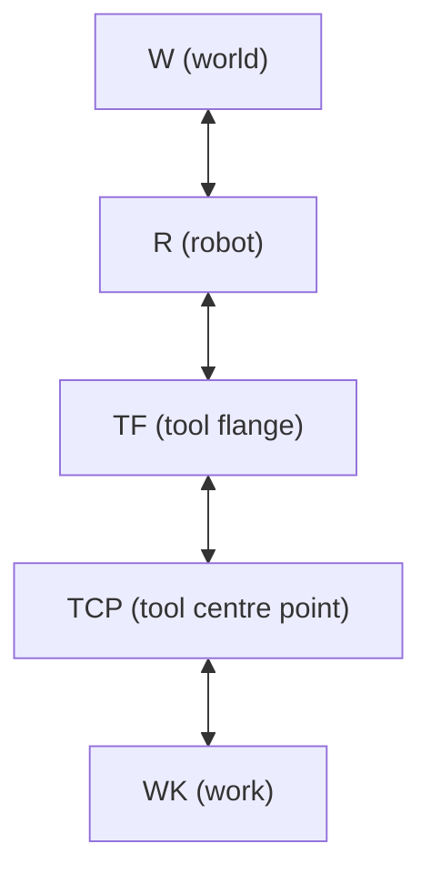
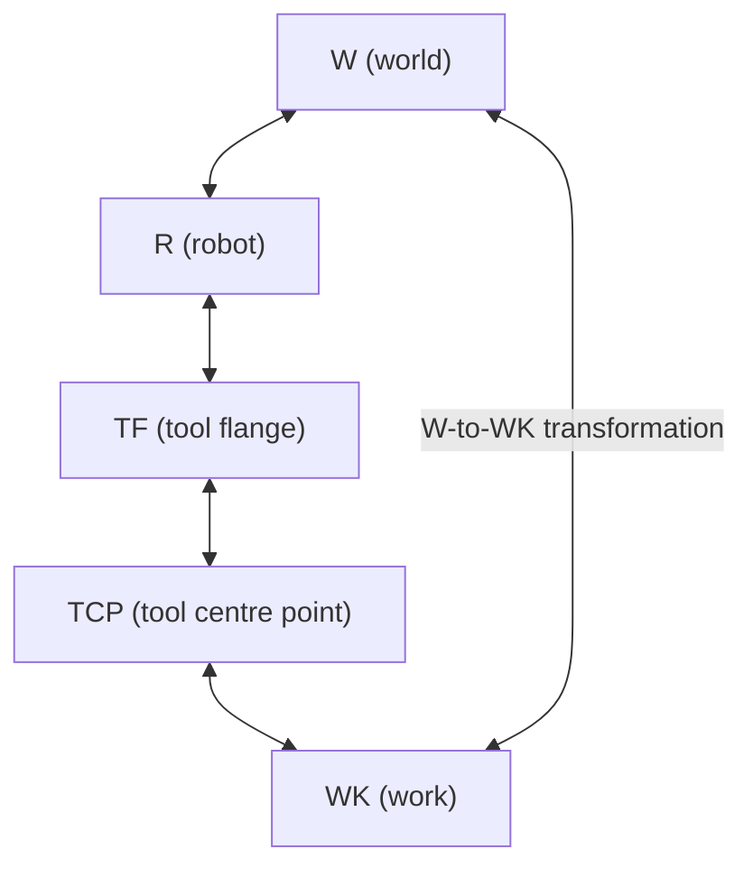
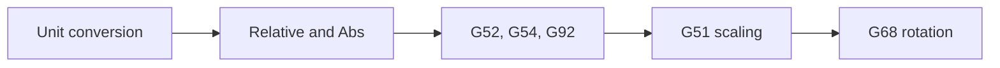

import {Tldr} from "../../../framework/components/Tldr"
import { Link } from "react-router-dom"

# {props.subtitle}

## Introduction

The frame section of the config is used to define the frames used.

Frames are the name attached to the different coordinate systems used for different parts of a machine and its environment and the relationship between them.

A Frame defines the position and orientation of one item with respect to another item with itself having a position and orientation.

The classic chain of frames for a robot is as follows:



The world frame (W), is usually a position in the cell that holds the robot.

The tool flange (TF) is the centre of the flange that holds tools on the end-effector of the robot.

Tool centre point (TCP) is the centre of teh actual tool attached to the robot.

Work (WK) is a position on the work item (part) that is to be operated on by the robot.

Between these frames transformations exist so that given a set of coordinates in (say) the work frame, we can work out the equivalent coordinates in the (say) the world frame.



These mappings are essential to controlling a robot as it allows a decoupling of the control program from the position of the work in the robot's environment.

gcode has its own concept of frames - its work and fixture offset commands.


These are also essential to writing gcode programs and &gbc supports these.

## Details

Every kinematics configuration must have a "blank frame" as frame 0 (the first in the list in the config).

Every move uses this frame as its default and so if another frame is not referenced this will be used.

Usually this frame is a null or "blank" frame and provides the following translation and rotation:

translation: (0,0,0)

rotation: (0,0,0,0) (implicitly the quaternion w to 1, i.e. no rotation)

absRel: (0) i.e. absolute

parent: (0) not used because absolute

in the example below, the frame 0, named `"default"` is the "blank frame":

```json
"default": {
},
```

Having friendly names for the keys is useful for documentation of your JSON file and these names are accessible in &gbr (in for example the jogging tile) but the API itself uses (array) indexes.

`"translation"` - this is a vector3 that describes the translation of the frame. The keys `"x"`, `"y"`, `"z"` are used for the translation distance in x,y & z.


`"absRel"` - `FRAME_ABSRELATIVE` - 0 = `FRAME_ABSOLUTE` frame referenced with absolute position, 1 = `FRAME_RELATIVE` frame referenced with relative position

`"parent"` - Link to the parent of the frame (link is by index i.e. number)

`"rotation"` - This is a quaternion that defines the rotation of the frame (`"x"`,`"y"`,`"z"`&`"w"` )

`"translation"`?: Vector3 - Translation of the frame


## Example JSON

```json
    "frames": {
        "default": {
        },
        "translate10": {
            "translation": {
                "x": 10
            }
        },
        "rotate90": {
            "rotation": {
                "x": 0.7071068,
                "y": 0,
                "z": 0,
                "w": 0.7071068
            }
        }
    },

```

## Link to schema documentation
`frames` maps to `FramesConfig` - see <Link to="/docs/gbc/schema/FramesConfig">here for the schema documentation</Link>
