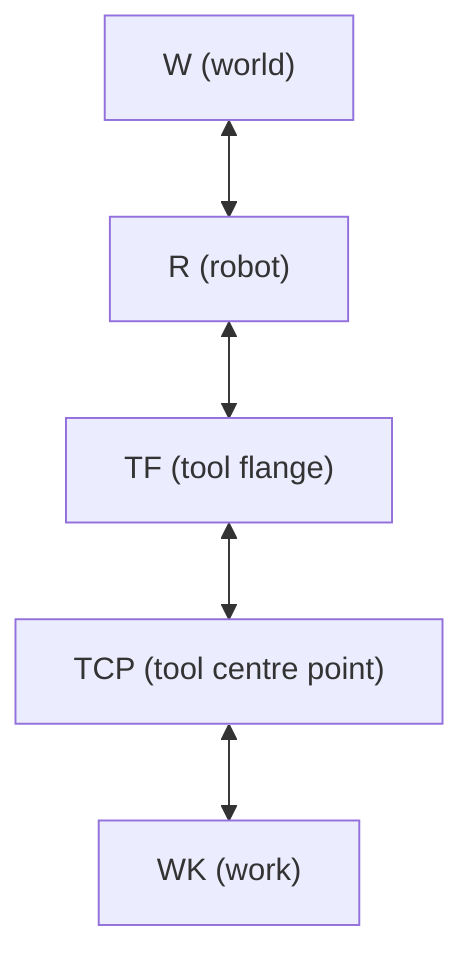
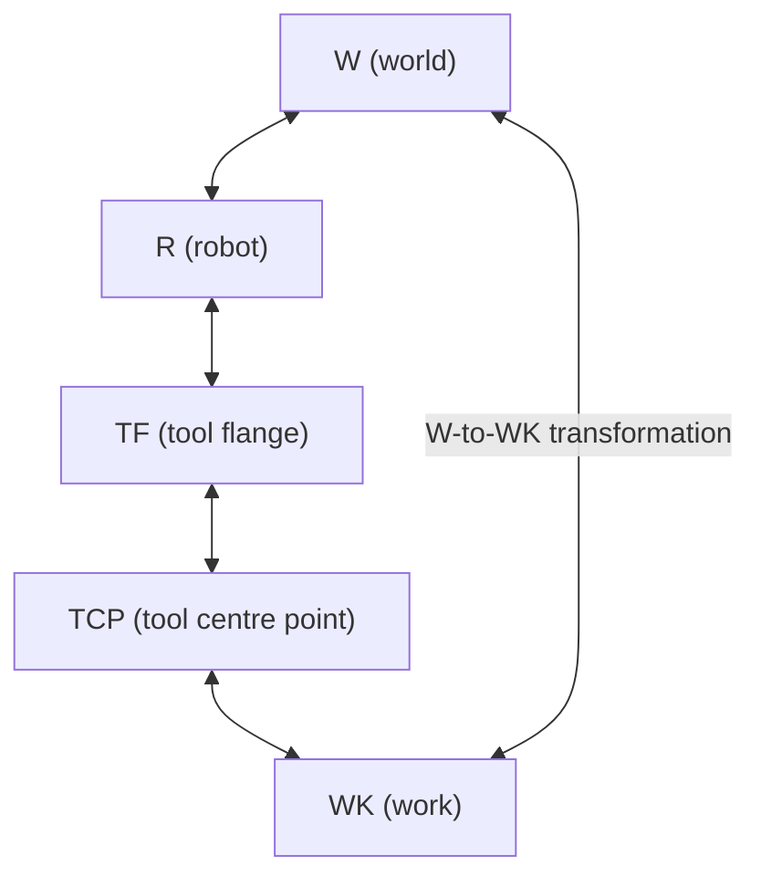
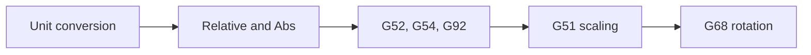

import {Tldr} from "../../../framework/components/Tldr"
import { Link } from "react-router-dom"
import {Card} from "antd"
import {GlowsiteLink} from "../../../framework";

# {props.subtitle}

## Introduction

The frame section of the config is used to define the frames used by &gbc and &gbr for co-ordinated moves.

Frames are the name attached to the different coordinate systems used for different parts of a machine and its environment and the relationship between them.

A Frame defines the position and orientation of one item with respect to another item itself having a position and orientation.

The classic chain of frames for a robot is as follows:



The world frame (W), is usually a position in the cell that holds the robot.

The tool flange (TF) is the centre of the flange that holds tools on the end-effector of the robot.

Tool centre point (TCP) is the centre of teh actual tool attached to the robot.

Work (WK) is a position on the work item (part) that is to be operated on by the robot.

Between these frames transformations exist so that given a set of coordinates in (say) the work frame, we can work out the equivalent coordinates in the (say) the world frame.



These mappings are essential to controlling a robot as it allows a decoupling of the control program from the position of the work in the robot's environment.

&gcode has its own concept of frames - its work and fixture offset commands.


These are also essential to writing &gcode programs and &gbc supports these.

## Tips for defining Frames configs

Every kinematics configuration must have a "blank frame" as frame 0 (the first in the list in the config).

Every move uses this frame as its default and so if another frame is not referenced this will be used.

Usually this frame is a null or "blank" frame and provides the following translation and rotation:

* translation: (0,0,0)
* rotation: (0,0,0,0) (implicitly the quaternion w to 1, i.e. no rotation by magic)
* absRel: (0) i.e. absolute
* parent: (0) not used because absolute

In the example below, the frame 0, named `"default"` is the "blank frame":

```json
"default": {
},
```

Because everything defaults to zero, this is the same as having the following in the config:

```json
"default": {
  "absRel": 0,
  "parent": 0,
  "translation": {
      "x": 0,
      "y": 0,
      "z": 0
  },
  "rotation": {
    "x": 0,
    "y": 0,
    "z": 0,
    "w": 1
  }
},

```

N.B. `"absRel"` is the `FRAME_ABSRELATIVE` enum and 0 = `FRAME_ABSOLUTE` which means the frame is referenced with absolute position and the parent is ignored. See the <GlowsiteLink to="/docs/types/FramesConfig">GBC Schema documentation</GlowsiteLink> for details.


Having friendly names for the keys is useful for documentation of your JSON file and these names are accessible in &gbr (in for example the jogging tile) but the API itself uses (array) indexes.


<Card title="frames Schema docs" extra={<GlowsiteLink to="/docs/types/FramesConfig">docs Link</GlowsiteLink>} style={{ width: 300 }}>

    `frames` in the config file maps to `FramesConfig` in the schema

    This documentation details the types, enums etc. behind this section of the config

    Click "docs Link" above to view
</Card>

## Example JSON

In this first example, we have three independent frames (they do not refer to each other).

The first frame is called `"default"` and is a blank frame.

The second frame is called `"translate10"` and is an absolute frame (implicitly 0 = `FRAME_ABSOLUTE`) and has zero rotation.

The third frame is called `"rotate90"` and is again an absolute frame (so has no parent) and has a quaternion rotation of (0.707, 0, 0 , 0.707) which (using  <a href="https://www.andre-gaschler.com/rotationconverter/"> this rotation conversion calculator</a>) is a rotation of ninety degrees in the x axis.

```json
    "frames": {
        "default": {
        },
        "translate10": {
            "translation": {
                "x": 10
            }
        },
        "rotate90": {
            "rotation": {
                "x": 0.7071068,
                "y": 0,
                "z": 0,
                "w": 0.7071068
            }
        }
    },

```


In this second example we define four frames. The first frame is called `"default"` and is a blank frame.

The second frame is another absolute frame called `"robot"` which we will use to define the position of the robot itself within the cell. It has no rotation but has a translation of 50 in x and y.

The frame is another absolute frame called `"pallet"` which we will use to define the position of the pallet within the cell.  It has no rotation but has a translation of 100 in x and y.

Finally we have a relative frame called `"part"`. This is relative to frame 2 which is `"pallet"` and is a translation of 10 in x.

```json
"frames": [
  {
    "name": "default"
  },
  {
    "name": "robot",
    "translation": {
    "x": 50,
    "y": 50,
    "z": 0
    }
  },
  {
    "name": "pallet",
    "translation": {
      "x": 100,
      "y": 100,
      "z": 0
     }
  },
  {
    "name": "part",
    "absRel": 1,
    "parent": 2,
    "translation": {
      "x": 10,
      "y": 0,
      "z": 0
    }
  }
]
```


