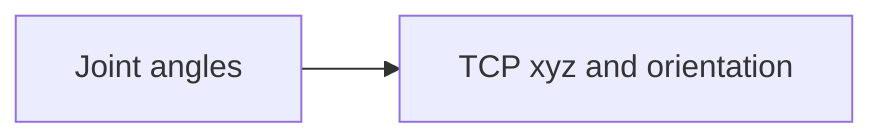
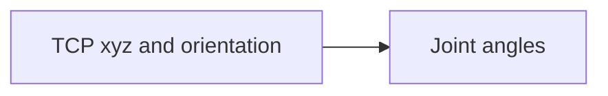

import {Tldr} from "../../../framework/components/Tldr"
import { Link } from "react-router-dom"
import {Card} from "antd"


# {props.subtitle}

## Introduction

### `joint: {}`

The `joint: {}` section of the config defines the joints that make up a machine.

Joints correspond to the axes/motors/actuators on your machine and in this section we define their kinematic limits (vmax, amax and jmax), the extent of their travels and the type of joint.

We also need to scale the position sent to the joints - see [scaling](scaling) for more details on how to set the scale factor.

These need to correspond to the joints defined in the &gbem or &gbsm configuration and (of course) to your actual machine.

### `kinematicsConfiguration: {}`

The `kinematicsConfiguration: {}`  section of the config is key to how &gbc works and defines the one or more kinematics configurations that make up your machine.

In &gbc a kinematics configuration is a collection of joints that are controlled in concert to produce motion.

A six DOF robot has six joints (motors) and these six joints are members of the kinematics configuration.

A three axis cartesian milling machine has 3 joints (XYZ) and these three joints are members of the kinematics configuration.

If the three axis cartesian milling machine also had an auxiliary axis (say a rotary table), another kinematics configuration would be added to config file and would contain just the joint for the rotary table.

Kinematics configurations need to have mathematical model attached to them and often these models are parameterised (with Kinematics chain parameters).

The toolkit contains mathematical kinematics models for common types of robots and, we add can more on customer request depending on what you need.

These mathematical models perform both the forward and inverse kinematics.

**Forward kinematics**

This maps the angles of a robot's joints to the cartesian position and orientation of the tool.


There is always one solution to the forward kinematics as if you fix the angles of all of a robot's joints then the tool will be in a defined position and pointing in a defined direction - there is no ambiguity.

**Inverse kinematics**

This maps a robot's tool cartesian position and orientation to the angle of the joints.

There are often multiple solutions to the inverse kinematics (multiple configurations)

## Tips for defining Joints and KinematicsConfiguration configs

### `joint: {}`

The key can be either a number or string. These names are accessible in &gbr and are useful to document your config file.

In the config there is a parameter `"finiteContinuous"`. This is the enum `JOINT_FINITECONTINUOUS`. <Link to="/docs/gbc/schema/JOINT_FINITECONTINUOUS">See here for more details</Link>

0 = `JOINT_FINITE` = joint is finite (has travel limits),  1 = `JOINT_CONTINUOUS` =  joint is continous (no travel limits).

This allows us to configure machines where the joint has no limits (for example a conveyor) plus "ordinary" joints which have a fixed travel.

We can invert the direction of motion of a joint with the `"isInverted"` parameter with 0 = not inverted, 1 = inverted motion.

The `"jointType"` is the enum `JOINT_TYPE` with 0 = `JOINT_PRISMATIC`= Joint type is prismatic (linear) and 1 = `JOINT_REVOLUTE` Joint type is revolute (rotary). <Link to="/docs/gbc/schema/JOINT_TYPE">See here for more details</Link>

This affects whether the joints motion is in linear units (for prismatic joints) or radians (for revolute joints).

<Card title="joint Schema docs" extra={<Link to="/docs/gbc/schema/JointConfig">docs Link</Link>} style={{ width: '100%' }}>

    `joint` in the config file maps to `JointConfig` in the schema

    This documentation details the types, enums etc. behind this section of the config

    Click "docs Link" above to view
</Card>


### `kinematicsConfiguration: {}`

The key can be either a number or string. These names are accessible in &gbr and are useful to document your config file.

Often we abbreviate Kinematics configurations to "kc".

Kcs have `"angularLimits"` which are defined in a `LimitConfiguration[]`. These angular limits define the angular kinematics limits (vmax, amax and jmax) for the kc as a whole.
Kcs also have `"linearLimits"` which define the linear kinematics limits of the kc.

These are separate the individual joint's kinematics limits.

`"kinematicsConfigurationType"` is the enum `KC_KINEMATICSCONFIGURATIONTYPE` which defines the mathematical kinematics model used for the kc <Link to="/docs/gbc/schema/KC_KINEMATICSCONFIGURATIONTYPE">see here for more details</Link>

List of linear limits to be applied to the kinematics configuration for different types of move

The Kinematics configuration has an extent, this is the maximum volume that kc operates in. Defined in terms of `"extentsX"`, `"extentsY"` and `"extentsZ"`.

`"frameIndex"` is a number that refers to the index of frame that is the base frame for the kc. It is used to orientate and translate the position of the kc.

`"kinChainParams"` is a matrix containing the DH (Denavit–Hartenberg) parameters for the kinematics model used by the kc. Not all kinematics models used parameters. For example the cartesian kinematics model is un-parameterised.

`"participatingJoints"` is an array of the indexes of the joints that participate in the kc. This is a zero indexed array based on the order the joints appear in the config file.

`"scaleX"`, `"scaleY"`, and `"scaleZ"` scales the position of the kc itself.

<Card title="kinematicsConfiguration Schema docs" extra={<Link to="/docs/gbc/schema/KinematicsConfigurationConfig">docs Link</Link>} style={{ width: '100%' }}>

    `kinematicsConfiguration` in the config file maps to `KinematicsConfigurationConfig` in the schema

    This documentation details the types, enums etc. behind this section of the config

    Click "docs Link" above to view
</Card>


## Example JSON

### `joint: {}`

In this config we define a set of 4 joints.

Joints 0, 1 & 2 are `JOINT_FINITE` because they default to 0 in the `JOINT_FINITECONTINUOUS` enum with 0 = `JOINT_FINITE`. All the three joints have `JOINT_TYPE` of `JOINT_PRISMATIC`.


The fourth joint is named `"Aux"` and they have `JOINT_TYPE` of `JOINT_REVOLUTE`.


```json
    "joint": {
        "0": {
            "limits": [
                {
                    "vmax": 200,
                    "amax": 4000,
                    "jmax": 80000
                }
            ],
            "scale": 1000.0
        },
        "1": {
            "limits": [
                {
                    "vmax": 200,
                    "amax": 4000,
                    "jmax": 80000
                }
            ],
            "scale": 1000.0
        },
        "2": {
            "limits": [
                {
                    "vmax": 200,
                    "amax": 4000,
                    "jmax": 80000
                }
            ],
            "scale": 1000.0
        },
        "aux": {
            "jointType": 1,
            "limits": [
                {
                    "vmax": 200,
                    "amax": 4000,
                    "jmax": 80000
                }
            ],
            "scale": 1000.0
        }
    },
```

### `kinematicsConfiguration: {}`

This config defines a single kinematics configuration called `"default"`.

It's frame index is

Joints 0, 1, 2 participate in this

KinematicsConfigurationType is 4


```json
    "kinematicsConfiguration": {
        "default": {
            "frameIndex": 0,
            "participatingJoints": [
                0,
                1,
                2
            ],
            "participatingJointsCount": 3,
            "kinematicsConfigurationType": 4,
            "extentsX": [
                -100,
                100
            ],
            "extentsY": [
                -100,
                100
            ],
            "extentsZ": [
                -100,
                100
            ],
            "linearLimits": [
                {
                    "vmax": 200,
                    "amax": 4000,
                    "jmax": 80000
                },
                {
                    "vmax": 10,
                    "amax": 200,
                    "jmax": 4000
                },
                {
                    "vmax": 20,
                    "amax": 400,
                    "jmax": 8000
                }
            ],
            "angularLimits": [
                {
                    "vmax": 100,
                    "amax": 1000,
                    "jmax": 10000
                }
            ],
            "kinChainParams": {
                "numRows": 6,
                "numCols": 5,
                "data": [
                    -90,
                    0,
                    0,
                    0,
                    0,
                    0,
                    0,
                    -90,
                    225,
                    0,
                    90,
                    0,
                    90,
                    0,
                    35,
                    -90,
                    0,
                    0,
                    0,
                    225,
                    90,
                    0,
                    0,
                    0,
                    0,
                    0,
                    0,
                    0,
                    0,
                    65
                ]
            }
        },
        "aux": {
            "frameIndex": 0,
            "participatingJoints": [
                3
            ],
            "participatingJointsCount": 1,
            "kinematicsConfigurationType": 0,
            "linearLimits": [
                {
                    "vmax": 200,
                    "amax": 4000,
                    "jmax": 80000
                }
            ],
            "angularLimits": [
                {
                    "vmax": 100,
                    "amax": 1000,
                    "jmax": 10000
                }
            ]
        }
    },
```


