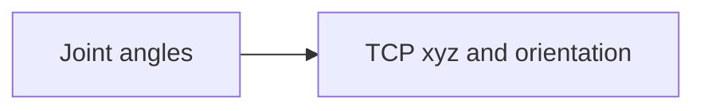
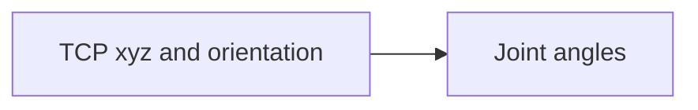

import {Tldr} from "../../../framework/components/Tldr"
import { Link } from "react-router-dom"

# {props.subtitle}

## Introduction

### `joint: {}`
The `joint: {}` section of the config defines the joints that make up a machine.

Joints correspond to the axes/motors/actuators on your machine and in this section we define their kinematic limits (vmax, amax and jmax), the extent of their travels and the type of joint.

We also need to scale the position sent to the joints - see [scaling](scaling.md) for more details on how to set the scale factor.

These need to correspond to the joints defined in the &gbem or &gbsm configuration and (of course) to your actual machine.

### `kinematicsConfiguration: {}`

The `kinematicsConfiguration: {}`  section of the config defines the one or more kinematics configurations that make up your machine.

In &gbc a kinematics configuration is a collection of joints that are controlled in concert to produce motion.

A six DOF robot has six joints (motors) these six joints are members of the kinematics configuration.

A three axis cartesian milling machine has 3 joints (XYZ) and these three joints are members of the kinematics configuration

Kinematics configurations need to have mathematical model attached to them and often these models are parameterised (Kinematics chain parameters).

The toolkit contains mathematical kinematics models for common types of robots and, we add can more on customer request depending on what you need.

These mathematical models perform both the forward and inverse kinematics.

**Forward kinematics**

This maps the angles of a robot's joints to the cartesian position and orientation of the tool.


There is always one solution to the forward kinematics as if you fix the angles of all of a robot's joints then the tool will be in a defined position and pointing in a defined direction - there is no ambiguity.

**Inverse kinematics**

This maps a robot's tool cartesian position and orientation to the angle of the joints.

There are often multiple solutions to the inverse kinematics (multiple configurations)

## Details

### `joint: {}`

The key can be either a number or string.

The main parameters are:

`"finiteContinuous"` - `JOINT_FINITECONTINUOUS` - 0 = `JOINT_FINITE` = joint is finite (has travel limits),  1 = `JOINT_CONTINUOUS` =  joint is continous (no travel limits)

`"isInverted"` 0 = not inverted, 1 = inverted motion

`"jointType"` - `JOINT_TYPE` - 0 = `JOINT_PRISMATIC`= Joint type is prismatic (linear), 1 = `JOINT_REVOLUTE` Joint type is revolute (rotary)

`"limits"`  LimitConfiguration[]

`"negLimit"` negative soft limit for the travel of the joint

`"posLimit"`number positive soft limit for the travel of the joint

`"scale"` number scale factor to be applied to a joint's position for transfer to the fieldbus


### `kinematicsConfiguration: {}`


The key can be either a number or string.

The main parameters are:

`"angularLimits"`"?: LimitConfiguration[]


`"extentsX"` - Extent (size) of workspace in X

`"extentsY"` - Extent (size) of workspace in Y

`"extentsZ"` Extent (size) of workspace in Z


`"frameIndex"`  ?: number

`"kinChainParams"`Matrix containing the DH parameters for the kinematics model

kinematicsConfigurationIndex?: number
Kinematics configuration type - i.e. the kinematics model that will be used. Used as discriminator for the union

`"kinematicsConfigurationType"`"?: KC_KINEMATICSCONFIGURATIONTYPE
List of linear limits to be applied to the kinematics configuration for different types of move

`"linearLimits"`"?: LimitConfiguration[]

participatingJoints?: number[]
participatingJointsCount?: number

`"scaleX"` - Scale factor to apply to X axis

`"scaleY"` - Scale factor to apply to Y axis

`"scaleZ"` - Scale factor to apply to Z axis


## Example JSON

### `joint: {}`

```json
    "joint": {
        "0": {
            "limits": [
                {
                    "vmax": 200,
                    "amax": 4000,
                    "jmax": 80000
                }
            ],
            "scale": 1000.0
        },
        "1": {
            "limits": [
                {
                    "vmax": 200,
                    "amax": 4000,
                    "jmax": 80000
                }
            ],
            "scale": 1000.0
        },
        "2": {
            "limits": [
                {
                    "vmax": 200,
                    "amax": 4000,
                    "jmax": 80000
                }
            ],
            "scale": 1000.0
        },
        "aux": {
            "jointType": 1,
            "limits": [
                {
                    "vmax": 200,
                    "amax": 4000,
                    "jmax": 80000
                }
            ],
            "scale": 1000.0
        }
    },
```

### `kinematicsConfiguration: {}`

```json
    "kinematicsConfiguration": {
        "default": {
            "frameIndex": 0,
            "participatingJoints": [
                0,
                1,
                2
            ],
            "participatingJointsCount": 3,
            "kinematicsConfigurationType": 4,
            "extentsX": [
                -100,
                100
            ],
            "extentsY": [
                -100,
                100
            ],
            "extentsZ": [
                -100,
                100
            ],
            "linearLimits": [
                {
                    "vmax": 200,
                    "amax": 4000,
                    "jmax": 80000
                },
                {
                    "vmax": 10,
                    "amax": 200,
                    "jmax": 4000
                },
                {
                    "vmax": 20,
                    "amax": 400,
                    "jmax": 8000
                }
            ],
            "angularLimits": [
                {
                    "vmax": 100,
                    "amax": 1000,
                    "jmax": 10000
                }
            ],
            "kinChainParams": {
                "numRows": 6,
                "numCols": 5,
                "data": [
                    -90,
                    0,
                    0,
                    0,
                    0,
                    0,
                    0,
                    -90,
                    225,
                    0,
                    90,
                    0,
                    90,
                    0,
                    35,
                    -90,
                    0,
                    0,
                    0,
                    225,
                    90,
                    0,
                    0,
                    0,
                    0,
                    0,
                    0,
                    0,
                    0,
                    65
                ]
            }
        },
        "aux": {
            "frameIndex": 0,
            "participatingJoints": [
                3
            ],
            "participatingJointsCount": 1,
            "kinematicsConfigurationType": 0,
            "linearLimits": [
                {
                    "vmax": 200,
                    "amax": 4000,
                    "jmax": 80000
                }
            ],
            "angularLimits": [
                {
                    "vmax": 100,
                    "amax": 1000,
                    "jmax": 10000
                }
            ]
        }
    },
```

## Link to schema documentation

`joint` maps to `JointConfig` - see <Link to="/docs/gbc/schema/JointConfig">here for the schema documentation</Link>

`kinematicsConfiguration` maps to `KinematicsConfigurationConfig` - see <Link to="/docs/gbc/schema/KinematicsConfigurationConfig">here for the schema documentation</Link>
