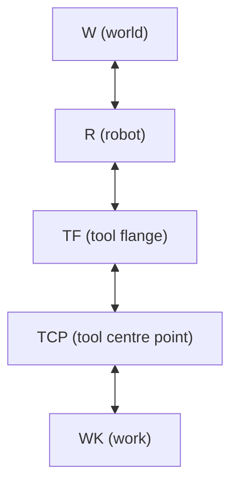
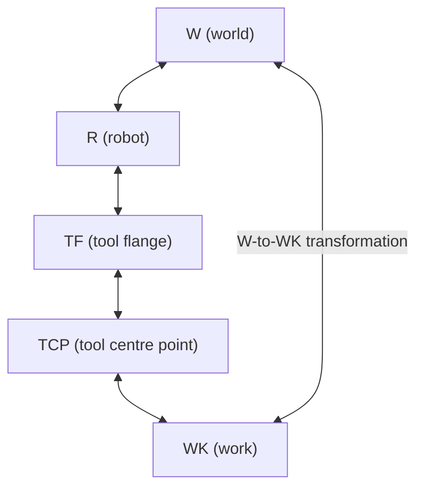
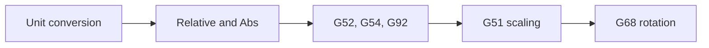

import {Tldr} from "../../../framework/components/Tldr"

# Frames

<Tldr>
    - Frames are a way of transforming between coordinate systems
    - Frames are key to both robots and gcode control
    - GBC supports both robot and gcode frames
</Tldr>

## Frames and robots

Frames are name attached to the different coordinate systems used for different parts of a machine and its environment and the relationship between them.

A Frame defines the position and orientation of one item with respect to another item with a given position and orientation.

The classic chain of frames for a robot is as follows.

The world frame (W), is usually a position in the cell that holds the robot.

The tool flange (TF) is the centre of the flange that holds tools on the end-effector of the robot.

Tool centre point (TCP) is the centre of teh actual tool attached to the robot.

Work (WK) is a position on the work item (part) that is to be operated on by the robot.

Between these frames transformations exist so that given a set of coordinates in (say) the work frame, we can work out the equivalent coordinates in the (say) the world frame.

These mappings are essential to controlling a robot as it allows a decoupling of the control program from the position of the work in the robot's environment.

## gcode & frames

gcode has its own concept of frames - its work and fixture offset commands.

These are also essential to writing gcode programs and GBC supports these.
