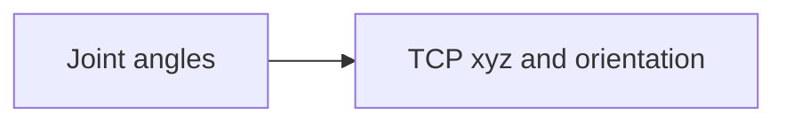
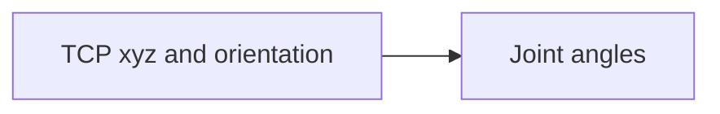

import {Tldr} from "../../../framework/components/Tldr"
import {Image} from "../../../framework/components/Image"
import lefty_righty from "./lefty_righty.png?glowsite"

# {props.subtitle}

<Tldr>
    - GBC includes forward and inverse kinematics models for common machine structures
    - Forward kinematics = angle of joints -> position and orientation of tool
    - Inverse kinematics = position and orientation of tool -> angle of joints
    - Multiple solutions to inverse kinematics
    - Different solution sets = robot configurations
</Tldr>

In GBC a kinematics configuration is a collection of joints that are controlled in concert to produce motion.

A six DOF robot has six joints (motors) these six joints are members of the kinematics configuration.

A three axis cartesian milling machine has 3 joints (XYZ) and these three joints are members of the kinematics configuration

Kinematics configurations need to have mathematical model attached to them and often these models are parameterised (Kinematics chain parameters).

The toolkit contains mathematical kinematics models for common types of robots and, we add can more on customer request depending on what you need.

# Forward kinematics
This maps the angles of a robot's joints to the cartesian position and orientation of the tool.

There is always one solution to the forward kinematics as if you fix the angles of all of a robot's joints then the tool will be in a defined position and pointing in a defined direction - there is no ambiguity.

# Inverse kinematics
This maps a robot's tool cartesian position and orientation to the angle of the joints.

There are often multiple solutions to the inverse kinematics (multiple configurations)

# Robot configurations

Where a robot can have multiple sets of joint angles that result in the same tool centre point (TCP) cartesian position and orientation, the robot has multiple configurations.

For example, for a standard industrial robot arm, one of their configurations is known as lefty and righty.

<Image meta={lefty_righty} alt="Robot lefty righty configurations"/>

