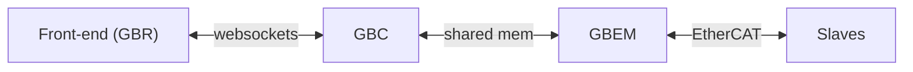

import {Tldr} from "../../../framework/components/Tldr"
import { Link } from "react-router-dom"
import gbem_bbd from "./gbem_bbd.svg"
import {GlowsiteLink} from "../../../framework";

# {props.subtitle}

<Tldr>
- Open source EtherCAT master
- CiA 402 based state machine framework
- Runs on Linux & Microcontroller
- Interfaces &gbc to EtherCAT network
</Tldr>

## License

&gbem is free software and you can redistribute it and/or modify it under the terms of the GNU General Public License version 2 as published by the Free Software Foundation.

The license is slightly modified to allow linking - see the LICENSE file on the GitHub repository.

## What does &gbem do?

&gbem provides a **framework to control EtherCAT slaves**. It allows you to easily configure a *machine* (a combination of EtherCAT IO devices and servo and stepper drives) and provides a simple interface through which you can interact with that machine without worrying about the nitty-gritty details of how EtherCAT drives and IO devices work.

It is designed to be used by programmers who want to build applications to control machines.

## Main features

* A CiA 402 based state machine framework to control machines and drives
* A configuration structure in which you can define the layout of your EtherCAT network (i.e. the structure of your machine)
* An ability to write your own PLC style functions in the C programming language to control EtherCAT IO
* A simple shared memory interface over which drives and IO can be controlled from your web stack high-level control application
* A signal, synchronous with the fieldbus bus cycle, to trigger the cyclic execution of higher level control functions
* Real-time execution - the lowest achievable cycle times depends on hardware. Typically, 0.5ms, 1ms or 4ms cycles are used
* A code based suitable for use on both Linux and microcontroller targets
* An EtherCAT master (based on SOEM)
* Open Source code base

A simple view of how &gbem operates is encapsulated in the following diagram.

&gbem is written exclusively in the C (C99) programming language and designed to be highly portable across different platforms. For example, we offer a version running on the STM32 microcontroller chipset.

The EtherCAT master communication layers within &gbem are based on the SOEM (Simple Open EtherCAT master) code base from the [Open EtherCAT Society](https://github.com/OpenEtherCATsociety/SOEM).

## How &gbem fits into the GB Control chain

&gbem allows you to interface &gbc with EtherCAT devices (slaves) like servo and stepper drives and different types of IO
such as digital and analog in/outs, encoder interfaces etc.

We have the [Front-end (GBR)] which is your browser-based control application that talks over websockets to [&gbc] which is the realtime control that talks over shared memory to [&gbem] which talks over EtherCAT to your [slaves] hardware.

&gbem doesn't *have* to be interfaced with &gbc. It provides a very simple shared memory interface over which processes can communicate with it.

## Docs structure

The documentation is structured around the main tasks that users undertake:
1. Compiling and running &gbem - <GlowsiteLink to="/docs/gbem/compiling_and_running">Compiling and running</GlowsiteLink>
1. Getting started with the example hardware - <GlowsiteLink to="/docs/gbem/getting_started_with_hardware">Getting started with example hardware</GlowsiteLink>
1. What drives are pre-configured to work with &gbem? - <GlowsiteLink to="/docs/gbem/drive_support_overview">Drive support</GlowsiteLink>
1. Configuring machines drives and slaves already supported by &gbem - <GlowsiteLink to="/docs/gbem/configuring_machines">Configuring machines</GlowsiteLink>
1. Adding support for new EtherCAT slaves (IO) - <GlowsiteLink to="/docs/gbem/adding_a_new_slave">Adding a new slave</GlowsiteLink>
1. Adding support for new EtherCAT drives - <GlowsiteLink to="/docs/gbem/adding_a_new_drive">Adding a new drive</GlowsiteLink>
1. Blow-by-blow guide to adding a JVL MIS drive - <GlowsiteLink to="/docs/gbem/adding_jvl_mis_drive">Blow-by-blow guide to adding a JVL MIS drive</GlowsiteLink>
1. Adding PLC functions to &gbem - <GlowsiteLink to="/docs/gbem/plc">PLC</GlowsiteLink>
1. Understanding which files to edit - <GlowsiteLink to="/docs/gbem/which_files_do_i_edit">Which files do I edit?</GlowsiteLink>
1. Deeper understanding of how &gbem works - <GlowsiteLink to="/docs/gbem/internals">Internals</GlowsiteLink>
1. Troubleshooting issues in the different layers - <GlowsiteLink to="/docs/gbem/troubleshooting">Troubleshooting</GlowsiteLink>
1. The status web interface to &gbem - <GlowsiteLink to="/docs/gbem/emstat">EMSTAT</GlowsiteLink>
1. The main &gbem configuration parameters - <GlowsiteLink to="/docs/gbem/gbem_config">gbem_config.h</GlowsiteLink>

There is also a <GlowsiteLink to="/docs/gbem/faq">FAQ</GlowsiteLink> and <GlowsiteLink to="/docs/gbem/terminology_guide">Terminology guide</GlowsiteLink>

## What skills do I need to work with &gbem?

**Basic C programming know-how** - we have tried to keep the code-base as simple as possible and so to work with &gbem you definitely don't need to be the world's best c programmer, but you do need to know how to create and debug simple c applications.

**Basic understanding of EtherCAT** - you do need to understand basically how EtherCAT slaves work. The documents and examples we have provided help to explain a lot of this but it would be helpful to read background information. You need to example know what an SDO and PDO object is, what Distributed Clocks (DC) do etc. There is oodles of information available on EtherCAT online but a lot of it has been written from a very protocol orientated perspective which is just not needed to work with EtherCAT in practice.

**Basic understanding of automation electricals** - you are going to be interacting with EtherCAT IO modules. They will need wiring up to sensors and actuators.  Depending on your experience, you may or may not need assistance with this.

**Basic understanding of Drives** - we are going to be interacting with fieldbus interfaced drives. They can be quite intimidating with instruction manuals weighing in at 100s or 1000s of pages. If you don't feel confident integrating you own drives then simply use one of the many types we have already integrated. We provide pointers to how to get them set-up in our range of drive guides.

**Understanding of machine safety** - if you are using &gbem to control machines you need to understand how to implement the safety features machines require.

## Why not just use a conventional PLC?

You absolutely can use a conventional PLC as part of the &gbt chain instead of &gbem. &gbem and PLCs are functionally equivalent - functions you can implement on a PLC can equally be implemented in &gbem and vice-versa.

However, as we are specifically seeking to support software developers write machine control, &gbem provides a way for them to do that without knowing anything about PLCs.

Also, &gbem does offer some advantages over conventional PLCs in some circumstances:

* You can use a proper IDE to develop software
* You can hook in traditional unit test frameworks to your code easily
* It works with Version Control Systems properly (for example, GitHub)
* You can use a "normal" programming language rather than  IEC 61131-3 languages
* It is Open Source, not proprietary
* You can easily bring in other Open Source code
* It runs on any Linux hardware and has been ported to STM32 if you want to run on your own custom hardware
* It is much more suitable to embed into a "product" where the user doesn't want to know anything about a PLC
* PLCs feel old-fashioned and awkward to use to a (relatively) modern software developer
