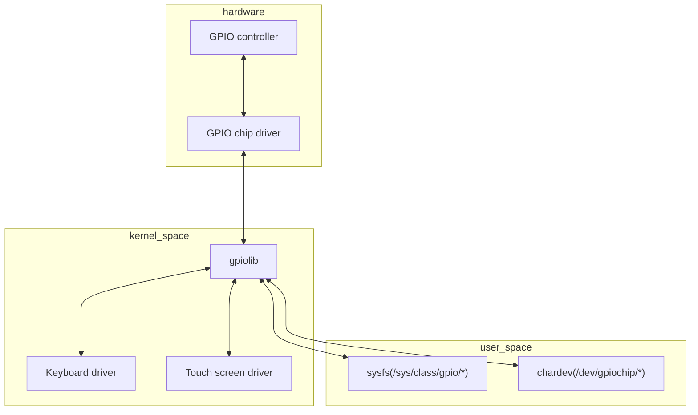

import {Tldr} from "../../../framework/components/Tldr"

# {props.subtitle}
<Tldr>
    - GPIO and SPI handled in various was on embedded Linux platforms
    - From Linux kernel version 4.8 userspace drivers
</Tldr>

## Introduction

Different embedded Linux platforms handle GPIO and SPI in different ways.

You will need to dive into the documentation for your SoC to find out how this works.

An increasingly common way to handle GPIO and SPI is to use the userspace kernel drivers.

Since version 4.8 the Linux kernel has a new interface based on character devices for accessing and managing GPIO lines in user space.




Every GPIO controller (gpiochip) will have a character device in /dev and we can use file operations (open(), read(), write(), ioctl(), poll(), close()) to manage and interact with GPIO lines:

```shell
# ls /dev/gpiochip*
/dev/gpiochip0  /dev/gpiochip2  /dev/gpiochip4  /dev/gpiochip6
/dev/gpiochip1  /dev/gpiochip3  /dev/gpiochip5  /dev/gpiochip
```


To use this new char device interface there is a library and a set of tools provided by the <a href="https://git.kernel.org/pub/scm/libs/libgpiod/libgpiod.git/"> libgpiod </a> project.

For example, the following program in C is using libgpiod to read a GPIO line:


```c
void main() {
	struct gpiod_chip *chip;
	struct gpiod_line *line;
	int req, value;

	chip = gpiod_chip_open("/dev/gpiochip0");
	if (!chip)
		return -1;

	line = gpiod_chip_get_line(chip, 3);
	if (!line) {
		gpiod_chip_close(chip);
		return -1;
	}

	req = gpiod_line_request_input(line, "gpio_state");
	if (req) {
		gpiod_chip_close(chip);
		return -1;
	}

	value = gpiod_line_get_value(line);

	printf("GPIO value is: %d\n", value);

	gpiod_chip_close(chip);
}
```


## SPI

Access to SPI is also handled by different SoCs in different ways. The SoC manufacturer may provide custom kernel drivers for you to use.

Obviously, you can write your own kernel SPI drivers where you have full access to IRQs etc. but this is a bit of a chew.

Whatever route you take you are probably going to have to some configuration work such as enabling SPI with a device tree overlay.

There is a user space SPI framework provided in the Linux kernel called spidev. This exports device files under /dev.

The standard reference code for using spidev is found in the <a href="https://github.com/torvalds/linux/blob/master/tools/spi/spidev_test.c"> linux documentation on GitHub</a>.


