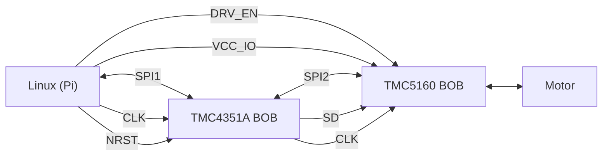

import {Col, Row} from "antd"
import {Image} from "../../../framework/components/Image"
import tmc4361a_bob from "./TMC4361A-BOB.png?glowsite"
import tmc5160_bob from "./TMC5160_BOB.jpg?glowsite"
import tmc5160_bob_r1_r2 from "./TMC5160-BOB-R1-R2.png?glowsite"
import TMC4361_TMC5160_proto_1 from "./TMC4361_TMC5160_proto_1.jpg?glowsite"
import {BogStandardHeaderRow, BogStandardRow, BogStandardCol} from "../../../framework/components/BogStandardTable";

# {props.subtitle}

## Introduction

The easiest way to prototype GBC/GBSM with the Trinamic TMC4361A & TMC5160 is with a Raspberry Pi and the Trinamic Break-out-boards (BOBs) for the ICs.

These can be connected together with jumper wires or on a breadboard or prototype board. There are 18 interconnections between the boards so it is a little fiddly but takes 10 minutes in practice.

This tutorial guides you through connecting together the hardware through to running GBSM, GBC and the front-end to jog a motor.

## BoM for prototype

The following components are needed to prototype the 

* Raspberry Pi 
* [TMC5610 BOB](https://www.trinamic.com/support/eval-kits/details/tmc5160-bob/)
* [TMC4361A BOB](https://www.trinamic.com/support/eval-kits/details/tmc4361a-bob/)
* Jumper wires (qty=20)
* 24V PSU - any 24V 3A PSU will do for testing
* Stepper motor (any small motor, ideally 2 phase 4 wire)

Additional motors can be added by adding additional TMC5160 & TMC4361A BoBs.

## Interconnections

## Pi->TMC4361A connections

<BogStandardHeaderRow>
    <BogStandardCol span={8}>
        Signal
    </BogStandardCol>
    <BogStandardCol span={8}>
        Raspberry Pi
    </BogStandardCol>
    <BogStandardCol span={8}>
        TMC4361-BOB
    </BogStandardCol>
</BogStandardHeaderRow>
<BogStandardRow>
    <BogStandardCol span={8}>
        VCC_IO
    </BogStandardCol>
    <BogStandardCol span={8}>
        3.3v (1)
    </BogStandardCol>
    <BogStandardCol span={8}>
        VCC_IO (1)
    </BogStandardCol>
</BogStandardRow>
<BogStandardRow>
    <BogStandardCol span={8}>
        GND
    </BogStandardCol>
    <BogStandardCol span={8}>
        GND (39)
    </BogStandardCol>
    <BogStandardCol span={8}>
        GND (2)
    </BogStandardCol>
</BogStandardRow>
<BogStandardRow>
    <BogStandardCol span={8}>
        TMC4361A CLK
    </BogStandardCol>
    <BogStandardCol span={8}>
        GPIO04 (7)
    </BogStandardCol>
    <BogStandardCol span={8}>
        CLK (3)
    </BogStandardCol>
</BogStandardRow>
<BogStandardRow>
    <BogStandardCol span={8}>
        TMC4361A NRST
    </BogStandardCol>
    <BogStandardCol span={8}>
        GPIO15 (10)
    </BogStandardCol>
    <BogStandardCol span={8}>
        NRST (4)
    </BogStandardCol>
</BogStandardRow>

<BogStandardRow>
    <BogStandardCol span={8}>
        SPI Chip select (CS)
    </BogStandardCol>
    <BogStandardCol span={8}>
        SPI0 CE0 N (24)
    </BogStandardCol>
    <BogStandardCol span={8}>
        CSN (5)
    </BogStandardCol>
</BogStandardRow>

<BogStandardRow>
    <BogStandardCol span={8}>
        SPI CLK
    </BogStandardCol>
    <BogStandardCol span={8}>
        SPI0 SCLK (23)
    </BogStandardCol>
    <BogStandardCol span={8}>
        SCK (6)
    </BogStandardCol>
</BogStandardRow>

<BogStandardRow>
    <BogStandardCol span={8}>
        MOSI
    </BogStandardCol>
    <BogStandardCol span={8}>
        SPI0 MOSI (19)
    </BogStandardCol>
    <BogStandardCol span={8}>
        SDI (7)
    </BogStandardCol>
</BogStandardRow>

<BogStandardRow>
    <BogStandardCol span={8}>
        MISO
    </BogStandardCol>
    <BogStandardCol span={8}>
        SPI0 MISO (21)
    </BogStandardCol>
    <BogStandardCol span={8}>
        SDO (8)
    </BogStandardCol>
</BogStandardRow>

##  Pi->TMC5160-BOB connections

<BogStandardHeaderRow>
    <BogStandardCol span={8}>
        Signal
    </BogStandardCol>
    <BogStandardCol span={8}>
        Raspberry Pi
    </BogStandardCol>
    <BogStandardCol span={8}>
        TMC5160-BOB
    </BogStandardCol>
</BogStandardHeaderRow>
<BogStandardRow>
    <BogStandardCol span={8}>
        VCC_IO
    </BogStandardCol>
    <BogStandardCol span={8}>
        GPIO02 (3)
    </BogStandardCol>
    <BogStandardCol span={8}>
        VCC_IO (1)
    </BogStandardCol>
</BogStandardRow>
<BogStandardRow>
    <BogStandardCol span={8}>
        TMC5160 CLK
    </BogStandardCol>
    <BogStandardCol span={8}>
        GPIO14 (8)
    </BogStandardCol>
    <BogStandardCol span={8}>
        CLK (8)
    </BogStandardCol>
</BogStandardRow>
<BogStandardRow>
    <BogStandardCol span={8}>
        TMC5160 DRV_ENN
    </BogStandardCol>
    <BogStandardCol span={8}>
        GPIO03 (5)
    </BogStandardCol>
    <BogStandardCol span={8}>
        DRV_ENN(9)
    </BogStandardCol>
</BogStandardRow>

## TMC4361A-BOB->TMC5160-BOB connections

<BogStandardHeaderRow>
    <BogStandardCol span={8}>
        Signal
    </BogStandardCol>
    <BogStandardCol span={8}>
        TMC4361A
    </BogStandardCol>
    <BogStandardCol span={8}>
        TMC5160-BOB
    </BogStandardCol>
</BogStandardHeaderRow>
<BogStandardRow>
    <BogStandardCol span={8}>
        GND
    </BogStandardCol>
    <BogStandardCol span={8}>
        GND (2)
    </BogStandardCol>
    <BogStandardCol span={8}>
        GND (2)
    </BogStandardCol>
</BogStandardRow>
<BogStandardRow>
    <BogStandardCol span={8}>
        SPI Chip select (CS)
    </BogStandardCol>
    <BogStandardCol span={8}>
        CSN_DRV (18)
    </BogStandardCol>
    <BogStandardCol span={8}>
        CSN (3)
    </BogStandardCol>
</BogStandardRow>
<BogStandardRow>
    <BogStandardCol span={8}>
        SPI CLK
    </BogStandardCol>
    <BogStandardCol span={8}>
        SCK_DRV (19)
    </BogStandardCol>
    <BogStandardCol span={8}>
        SCK (4)
    </BogStandardCol>
</BogStandardRow>
<BogStandardRow>
    <BogStandardCol span={8}>
        MOSI
    </BogStandardCol>
    <BogStandardCol span={8}>
        SDI_DRV (21)
    </BogStandardCol>
    <BogStandardCol span={8}>
        SDI (5)
    </BogStandardCol>
</BogStandardRow>
<BogStandardRow>
    <BogStandardCol span={8}>
        MISO
    </BogStandardCol>
    <BogStandardCol span={8}>
        SDO_DRV (20)
    </BogStandardCol>
    <BogStandardCol span={8}>
        SDO (6)
    </BogStandardCol>
</BogStandardRow>
<BogStandardRow>
    <BogStandardCol span={8}>
        STEP
    </BogStandardCol>
    <BogStandardCol span={8}>
        STPOUT (22)
    </BogStandardCol>
    <BogStandardCol span={8}>
        REFL (10)
    </BogStandardCol>
</BogStandardRow>
<BogStandardRow>
    <BogStandardCol span={8}>
        DIR
    </BogStandardCol>
    <BogStandardCol span={8}>
        STPDIR (23)
    </BogStandardCol>
    <BogStandardCol span={8}>
        REFR (11)
    </BogStandardCol>
</BogStandardRow>

<Row>
    <Col span={12}>
        <h2>TMC4361A Break-Out Board</h2>
        <Image meta={tmc4361a_bob} alt="TMC4361A BOB" maxWidth={250}/>
    </Col>
    <Col span={12}>
        <h2>TMC5160 Break-Out Board</h2>
        <Image meta={tmc5160_bob} alt="TMC5160 BOB" maxWidth={250}/>
    </Col>
</Row>

## Enabling step/dir mode on the TMC5160

To use the TMC5160 with the prototype, we need to enable step/dir mode on the TMC5160-BOB.

The TMC5160 can be used in one of two modes. 1) With integrated motion controller 2) in step/dir mode.

We are using the TMC5160 essentially as an output stage so we need to use step/dir mode.

On the TMC5160-BOB this can be done by desoldering R2 and soldering it to R1. If you are not used to SMD device soldering it is a bit fiddly so lay off the booze and coffee to have your steadiest hands ready.

The location of R1 & R2 on the board are shown here:

<Image meta={tmc5160_bob_r1_r2} alt={"TMC5160 R1 R2"} maxWidth={250}/>

## Assembled prototype environment

We used a little prototype board to aid with the assembling of the prototype.

You can just connect the BOBs together with jumper wires if you are feeling that way inclined.

Trinamic produce a similar little board their <a href="https://www.trinamic.com/products/modules/details/tmc-schraubstock/"> TMC-Schraubstock (vice)</a>.

<Image meta={TMC4361_TMC5160_proto_1} alt={"Prototype wiring"}/>

We used a Keysight <a href="https://www.keysight.com/gb/en/support/E36104B/dc-power-supply-35v-1a-35w.html">E36104B</a> bench power supply for our testing.

You can "daisy-chain" other BOBs together in this way to test with more than one axis.
