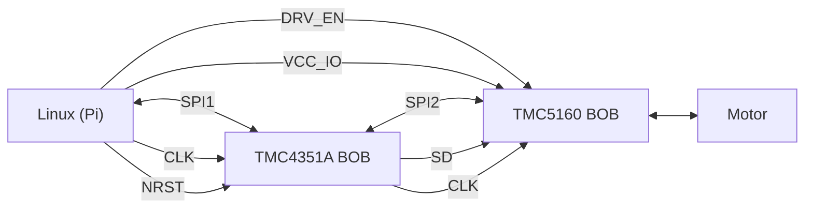

import {Col, Row} from "antd"
import {Image} from "../../../framework/components/Image"
import tmc4361a_bob from "./TMC4361A-BOB.png?glowsite"
import tmc5160_bob from "./TMC5160_BOB.jpg?glowsite"
import tmc5160_bob_r1_r2 from "./TMC5160-BOB-R1-R2.png?glowsite"
import TMC4361_TMC5160_proto_1 from "./TMC4361_TMC5160_proto_1.jpg?glowsite"

# Prototyping with TMC4361A & TMC5160

## Introduction

The easiest way to prototype GBC/GBSM with the Trinamic TMC4361A & TMC5160 is with a Raspberry Pi and the Trinamic Break-out-boards (BOBs) for the ICs.

These can be connected together with jumper wires or on a breadboard or prototype board. There are 18 interconnections between the boards so it is a little fiddly but takes 10 minutes in practice.

This tutorial guides you through connecting together the hardware through to running GBSM, GBC and the front-end to jog a motor.

## BoM for prototype

The following components are needed to prototype the 

* Raspberry Pi 
* [TMC5610 BOB](https://www.trinamic.com/support/eval-kits/details/tmc5160-bob/)
* [TMC4361A BOB](https://www.trinamic.com/support/eval-kits/details/tmc4361a-bob/)
* Jumper wires (qty=20)
* 24V PSU - any 24V 3A PSU will do for testing
* Stepper motor (any small motor, ideally 2 phase 4 wire)

Additional motors can be added by adding additional TMC5160 & TMC4361A BoBs.

## Interconnections

## Pi->TMC4361A

| **Signal**           | **Raspberry Pi ** | **TMC4361-BOB** |
| -------------------- | ----------------- | --------------- |
| VCC_IO               | 3.3v (1)          | VCC_IO (1)      |
| GND                  | GND (39)          | GND (2)         |
| TMC4361A CLK         | GPIO04 (7)        | CLK (3)         |
| TMC4361A NRST        | GPIO15 (10)       | NRST (4)        |
| SPI Chip select (CS) | SPI0 CE0 N (24)   | CSN (5)         |
| SPI CLK              | SPI0 SCLK (23)    | SCK (6)         |
| MOSI                 | SPI0 MOSI (19)    | SDI (7)         |
| MISO                 | SPI0 MISO (21)    | SDO (8)         |

###  Pi->TMC5160-BOB

| **Signal**      | **Raspberry Pi** | **TMC5160-BOB** |
| --------------- | ---------------- | --------------- |
| VCC_IO          | GPIO02 (3)       | VCC_IO (1)      |
| TMC5160 CLK     | GPIO14 (8)       | CLK (8)         |
| TMC5160 DRV_ENN | GPIO03 (5)       | DRV_ENN(9)      |

### TMC4361A-BOB->TMC5160-BOB

| **Signal**           | **TMC4361A** | **TMC5160-BOB** |
| -------------------- | ------------ | --------------- |
| GND                  | GND (2)      | GND (2)         |
| SPI Chip select (CS) | CSN_DRV (18) | CSN (3)         |
| SPI CLK              | SCK_DRV (19) | SCK (4)         |
| MOSI                 | SDI_DRV (21) | SDI (5)         |
| MISO                 | SDO_DRV (20) | SDO (6)         |
| STEP                 | STPOUT (22)  | REFL (10)       |
| DIR                  | STPDIR (23)  | REFR (11)       |

<Row>
    <Col span={12}>
        <h2>TMC4361A Break-Out Board</h2>
        <Image meta={tmc4361a_bob} alt="TMC4361A BOB" preset="narrow"/>
    </Col>
    <Col span={12}>
        <h2>TMC5160 Break-Out Board</h2>
        <Image meta={tmc5160_bob} alt="TMC5160 BOB" preset="narrow"/>
    </Col>
</Row>

<Image meta={tmc5160_bob_r1_r2} alt={"TMC5160 R1 R2"}/>

<Image meta={TMC4361_TMC5160_proto_1} alt={"Prototype wiring"}/>