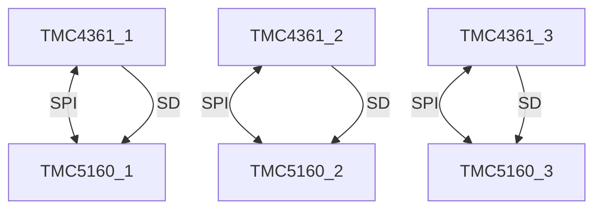
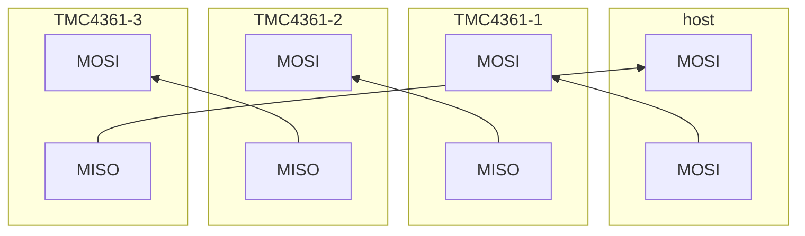

# TMC4361 & TMC5160

## Introduction

Cyclic synchronous positioning of motors drivers is where the input to the motor driver hardware is a position value which changes every 1ms, 2ms, 4ms etc.

This can be done on a microcontroller in software (see the glowbuzzer ST- STEP implementation) but there are some challenges in this implementation:
* needs to run as a high speed SPI slave which is always tricky in microcontrollers
* the timing requirements need hardware timer resources and so you often end up with multiple microcontrollers for multiple axes and often the interrupt load is high making it difficult to utilise the microcontrollers for other tasks

The TMC4351 & TMC5160 solution is an alternative solution to the problem of driving stepper motors with cyclic synchronous positions using dedicated ICs.

It is suitable for use both in an embedded Linux or microcontroller environment as the input to sub-system is just a position sent over SPI every millisecond or so.

The TMC4351 & TMC5160 have been chosen very carefully for this application. It is not possible to pick up any stepper driver chip and expect it to easily integrate in this way.

## TMC4361

TMC4361 is a motion controller but we don't use its ability to generate trajectories (ramps) but use its synchronisation capabilities to generate a train of high speed step/direction signals in response to the positions that we provide it with each millisecond.

The TMC4361 supports the following features that are key:
* suppports incremental and absolute encoders over a ABN, SSI or SPI interface.
* supports closed loop operation
* supports software limits to travel

It has a freeze capability but this is done in software and can't provide a  safety rated STO solution. So for applications requring proper functional satefy it is probably best to implement STO using driver supply switching (smart high-side power switch - for example the TPS27S100).

## TMC5160

TMC5160 is a motion controller/driver. We just use its (pre)driver capabilities with the motion controller side of the chip disabled. 

two-phase bipolar stepper motor.
External MOSFETs for up to 20A motor current per coil

8-60v
256 microsteps

They contain all the Trinamic fancy features: StallGuard2, CoolStep,
DcStep, SpreadCycle, and StealthChop.

* **StealthChop** - No-noise, high-precision chopper algorithm for inaudible motion and inaudible standstill of the motor
* **SpreadCycle** - High-precision chopper algorithm for highly dynamic motion and absolutely clean current wave. Low noise, low resonance and low vibration chopper
* **DcStep** - Load dependent speed control. The motor moves as fast as possible and never loses a step
* **StallGuard** - Sensorless stall detection and mechanical load measurement.
* **CoolStep** - Load-adaptive current control reducing energy consumption by as much as 75%
* **MicroPlyer** - Microstep interpolator for obtaining full 256 microstep smoothness with lower resolution step inputs starting from fullstep

Can also use the TMC5130 with an integrated 1.4A driver for smaller motors or the TMC5160 with external mosfets for higher power apps

we use its step /direction interface with the TMC4361 generating the steps

8 mosfets are needed for the drive. If you don't use the suggested components, you will need to do some careful selection and a bit of tuning for which is a bit fiddly and you may need to fire up your oscilloscope. The probing is a bit fiddly but nothing too challenging if you have some skills. Top tip: use pig tails not rat tails with your probes - it makes a substantial difference.   

## Notes

* Encoders connect to the TMC4361 not TMC5160
* Ref switches connect to the TMC4361 not TMC5160
* TMC5160 either has an internal clock (?MHz) (tie clock pin to ground) or can take an external clock from the TMC4361A
* TMC5160 reset is via VCC_IO pin (low current can be driven from GPIO)
* 

## TMC4361 to TMC5160 connection

The TMC4361 to TMC5160 connection is via both SPI for exchanging configuration and status information and with step / direction signals.

## Daisy chaining

