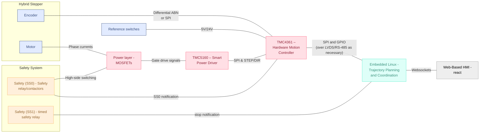

# Test MDX page with mermaid

```mermaid

flowchart LR
 subgraph inputs["Hybrid Stepper"]
        motor["Motor"]
        encoder["Encoder"]
  end
 subgraph safety["Safety System"]
        ss0["Safety (SS0) - Safety<br>relay/contactors"]
        ss1["Safety (SS1) - timed<br>safety relay"]
  end
    motor -- Phase currents --- powerLayer["Power layer -<br>MOSFETs"]
    powerLayer -- Gate drive signals --- tmc5160["TMC5160 – Smart<br>Power Driver"]
    encoder -- Differential ABN<br>or SPI --- tmc4361["TMC4361 –<br>Hardware Motion<br>Controller"]
    refSwitches["Reference switches"] -- 5V/24V ---- tmc4361
    ss0 -- "High-side switching" --- powerLayer
    tmc5160 -- SPI & STEP/DIR --- tmc4361
    ss0 -- SS0 notification --- tmc4361
    tmc4361 -- "SPI and GPIO<br>(over LVDS/RS-485 as necessary)" --- embeddedLinux["Embedded Linux -<br>Trajectory Planning<br>and Coordination"]
    ss1 -- stop notification --- embeddedLinux
    embeddedLinux -- Websockets --- webHMI["Web-Based HMI -<br>react"]

     motor:::Sky
     encoder:::Sky
     ss0:::Peach
     ss1:::Peach
     powerLayer:::Rose
     tmc5160:::Rose
     tmc4361:::Rose
     refSwitches:::Sky
     embeddedLinux:::Aqua
     webHMI:::Ash
    classDef Peach stroke-width:1px, stroke-dasharray:none, stroke:#FBB35A, fill:#FFEFDB, color:#8F632D
    classDef Sky stroke-width:1px, stroke-dasharray:none, stroke:#374D7C, fill:#E2EBFF, color:#374D7C
    classDef Rose stroke-width:1px, stroke-dasharray:none, stroke:#FF5978, fill:#FFDFE5, color:#8E2236
    classDef Aqua stroke-width:1px, stroke-dasharray:none, stroke:#46EDC8, fill:#DEFFF8, color:#378E7A
    classDef Ash stroke-width:1px, stroke-dasharray:none, stroke:#999999, fill:#EEEEEE, color:#000000
```

